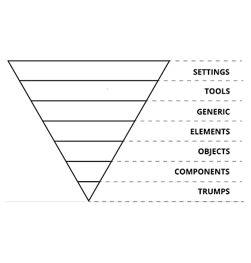
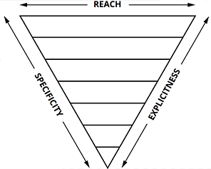

# CALIDAE CSS #

Això és una primera proposta dels acords d'estil, nomenclatura i organització del CSS als projectes de Calidae.

***

### Objectius de la guia ###

* Simplificar la comprensió del codi, tant per nous desenvolupadors com per quan recuperem un projecte antic. Facilitar el code review del CSS.

* Aconseguir una major coherència entre els diferents projectes que desenvolupem.

* Augmentar la velocitat de desenvolupament.

* Millorar l’escalabilitat del codi.

* Millorar la comunicació entre dissenyadors i desenvolupadors.

* Millorar, definir (i documentar) les bones pràctiques al desenvolupar CSS.


### Warnings ###
1. En aquesta guia es parla de com s'escriu i s'organitza el CSS de forma genèrica i universal, amb frases com "El CSS s'organitza en 7 capes". Evidentment, la referència és únicament a la proposta d'organització de CSS a Calidae, i no a qualsevol implementació de CSS.

2. Les decisions d'aquesta guia estan basades en l'experiència d'altres desenvolupadors que s'han trobat amb problemes semblants als que volem solucionar. Per això és important consultar les fonts de cada punt de la guia, per entendre correctament els principis que els justifiquen.


## Índex ###

1. [Les 7 capes de CSS](#markdown-header-les-7-capes-de-css)

2. [Namespaces](#markdown-header-namespaces)

3. [Single responsibility](#markdown-header-single-responsibility)

4. [Nomenclatura de classes](#markdown-header-nomenclatura-de-classes)

5. [Nesting](#markdown-header-nesting)

6. [Encapsulament de frameworks](#markdown-header-encapsulament-de-frameworks)

7. [Estructura de fitxers](#markdown-header-estructura-de-fitxers)

8. [No ID's](#markdown-header-no-id)

9. [Media Queries](#markdown-header-media-queries)

10. [Grid](#markdown-header-grid)

111. [CSS Linting](#markdown-header-css-linting)

***

## Les 7 capes de CSS
El CSS s'organitza en 7 capes en forma de triangle invertit:



Les capes són les següents:

* **Settings**: variables globals de configuració, definició de colors, etc.

* **Tools**: mixins i funcions globals. És important que no existeixi cap output de CSS en aquestes dues primeres capes (*i.e.* un projecte amb només Settings i Tools hauria de generar un arxiu CSS buit).

* **Generic**: reset/normalització d'estils, box-sizing, etc. És la primera capa que genera CSS compilat.

* **Elements**: definicions d'estils per elements HTML purs (H1, A, TABLE, etc). Aquests elements tenen estils per defecte del navegador, així que es poden redefinir aquí.

* **Objects**: Selectors basats en classes que defineixen patrons de disseny sense estil, abstractes, com per exemple el [Media Object](http://www.stubbornella.org/content/2010/06/25/the-media-object-saves-hundreds-of-lines-of-code/) o el [Nav](https://csswizardry.com/2011/09/the-nav-abstraction/). Aquests objects estan basats en [OOCSS, Object Oriented CSS](https://www.smashingmagazine.com/2011/12/an-introduction-to-object-oriented-css-oocss/). Modificar alguna propietat CSS d'un Object és una acció delicada que probablement tingui conseqüències més enllà de la modificació d'una instància concreta.

* **Components**: components específics de la UI. Aquí és on es desenvolupa la gran majoria de la feina en cada projecte. Els components d'una interfície acostumen a estar compostos d'Objectes i Components. Modificar un component no ha de tenir conseqüències fora del context que estiguem desenvolupant.

* **Utilities**: classes d'utilitat i helpers amb la capacitat de sobreescriure qualsevol regla definida prèviament en el triangle, e.g. classes per amagar contingut. Probablement utilitzin `!important` en les seves definicions.

La forma de triangle mostra com els estils generats s'ordenen: d'estils genèrics a explícits, de poc específics a més específics, i des de globals a atòmics.



Tot el CSS queda ordenat, doncs, segons aquestes tres mètriques:

1. **De genèric a explícit**. Comencem definint els atributs més genèrics, amb un abast més ampli, de baix nivell, i anem movent-nos cap a selectors més concrets i a mesura que anem baixant de nivell.

2. **De baixa a alta especificitat**. Els selectors amb menys especificitat apareixen més a prop de l'inici del CSS, i l'especificitat va augmentant progressivament a mida que avancem en el codi. D'aquesta manera evitem "guerres d'especificitat" tan com sigui possible. L'especificitat sempre creix cap avall.

3. **D'ampli espectre a localitzat**. Selectors del principi del CSS afecten àmpliament al DOM, i cada vegada els selectors afectaran a elements més concrets. 

Font: [Manage large CSS projects with ITCSS](http://www.creativebloq.com/web-design/manage-large-css-projects-itcss-101517528)

Font: [ITCSS: Scalable and Mantainable CSS Architecture](https://www.xfive.co/blog/itcss-scalable-maintainable-css-architecture/)


### Què són els Objects i com funcionen: Single Responsibility Principle i Open/Closed Principle
Val la pena dedicar unes línies a què són els Objects i com es diferencien dels Components.

Els Objects són *abstraccions* de disseny, és a dir, no estan lligats a una maquetació concreta i només responen a un patró de disseny reutilitzable.

Els Objects serveixen principalment per dos objectius:

1. **Separen l'estructura de la vista**. L'estructura i el posicionament són tasques dels Objects, mentre que les característiques visuals són responsabilitat dels Components.

2. **Separen els contenidors dels continguts**. No cal imitar l'estructura de l'HTML al CSS. És molt més útil definir classes que descriuen l'ús d'un tag HTML.


Dels 5 [principis SOLID](https://scotch.io/bar-talk/s-o-l-i-d-the-first-five-principles-of-object-oriented-design), els Objects en segueixen bàsicament dos:

* **Single-responsibility Principle**. Un Object té una responsabilitat i cap altra, amb els beneficis que això comporta de facilitat de manteniment i extensibilitat.

    Font: [The single responsibility principle applied to CSS](https://csswizardry.com/2012/04/the-single-responsibility-principle-applied-to-css/).

* **Open-Closed Principle**. Un Object està obert a extensions i tancat a modificacions. Mai s'ha de modificar un Object: si un Object no encaixa a la implementació d'un element de la UI, simplement no s'ha de fer servir. 

    Font: [The open/closed principle applied to CSS](https://csswizardry.com/2012/06/the-open-closed-principle-applied-to-css/).

A diferència dels Objects, els Components no són abstraccions de patrons de disseny sinó implementacions concretes de la UI.


***
[*Back to top*](#markdown-header-objectius-de-la-guia)


***
## Namespaces 
Les classes de CSS definides utilitzen un prefix que indiquen en quin nivell de la piràmide es troben. Aquests són els prefixos que utilitzem:

* `o-`. Indica que es tracta d'un Object, és a dir, d'un element que pot estar-se utilitzant en altres contextos. Anar molt en compte al fer-hi modificacions i fer-ho si realment és l'única solució vàlida.

* `c-`. Indica que es tracta d'un Component. És una implementació concreta de la UI. Qualsevol canvi que es faci a l'estil d'aquesta classe hauria de ser detectable en el context actual. Modificar aquesta classe ha de ser segur i no ha de tenir efectes secundaris.

* `u-`. Indica que es tracta d'una Utility. Té un rol molt específic (habitualment un sol atribut CSS) i no hauria de modificar-se mai. Es pot reutilitzar i no està lligada a cap implementació de la UI.

* `js-`. Indica que es tracta d'una classe per Javascript. Aquesta classe serveix per bindejar l'element a la lògica que afegeixi el Javascript a la UI. Una classe amb aquest prefix no hauria ni d'aparèixer als fitxers `.scss` del projecte, ja que no ha de tenir atributs associats. Val la pena notar que, tot i definir aquest namespace, probablement sigui molt més pràctic bindejar Javascript a l'ID d'un element o a un atribut `data-` ([font](https://www.w3schools.com/tags/att_global_data.asp)).

Font: [More Transparent UI Code with Namespaces](https://csswizardry.com/2015/03/more-transparent-ui-code-with-namespaces/)

Excepte el prefix `.js`, noti's que els altres tres prefixos corresponen als tres últims nivells de la piràmide de CSS.


### Exemples

```css
/* Object class */
.o-media { }

/* Component class */
.c-form { }

/* Utility class */
.u-hidden { }

/* Javascript class */
.js-result-list { }
```


***
[*Back to top*](#markdown-header-objectius-de-la-guia)


***
## Single responsibility
El principi de responsabilitat única, un dels cinc principis SOLID de desenvolupament de software, defineix que una classe només ha de tenir una raó per canviar, i no més.

D'aquesta manera, el codi resultant és més robust i es pot reaprofitar molt més al combinar-lo amb altres blocs de codi semblants. A més són molt més senzills d'entendre.


```html
<nav class="global-nav">...</nav> <!-- Bad -->

<nav class="wrapper menu fixed branded">...</nav> <!-- Good -->
```

Noti's que en aquest exemple no s'utilitzen ni Namespaces ni cap tipus de nomenclatura específica. **L'exemple només serveix com a mostra de classes de responsabilitat única**.

Font: [The single responsibility principle applied to CSS](https://csswizardry.com/2012/04/the-single-responsibility-principle-applied-to-css/).


***
[*Back to top*](#markdown-header-objectius-de-la-guia)


***
## Nomenclatura de classes
L'estructura dels noms de les classes és la següent:

`.[namespace]-[block]__[element]--[modificador]`

Noti's els dos guionets baixos entre bloc i element, i els dos guionets entre element i modificador.

Basat en la metodologia [BEM](http://bem.info/), aquesta estructura defineix tres ítems bàsics: **Blocs**, **Elements** i **Modificadors**.


### Bloc ###
Encapsula un element que té sentit per si sol. Es mapeja fàcilment amb Objects i Components. Els blocs es poden anidar i interactuar amb altres blocs, però no tenen precedències ni herències entre ells.

```html
<div class="c-form">...</div>
```
```css
.c-form {} /* Good */

div.c-form {} /* Bad */
```

*Rule of thumb*: Un Bloc no hauria de tenir atributs com `width`, `float` o `margin`, perquè un bloc ha de ser suficientment desacoplat de la UI com per poder-lo reaprofitar en altres contextos (i fins i tot altres projectes/webs/apps).

Un bloc pot anidar-se dins d'altres blocs a nivell semàntic (HTML), però no a nivell de CSS.

### Element ###
Part d'un bloc que no té sentit per si sol. Qualsevol element està semànticament lligat al seu bloc.

Dins d'un bloc, tots els elements són semànticament iguals.

```html
<div class="c-form">
    <div class="c-form__input">
        <div class="c-form__icon">
        </div>
    </div>
    ...
</div>
```
```css
.c-form__input {} /* Good */
.c-form__icon {} /* Good */

div.c-form__input {} /* Bad */
.c-form .c-form__input .c-form__icon {} /* Bad */
.c-form__input .c-form__icon {} /* Bad */
.c-form__input > .c-form__icon {} /* Bad */
```


### Modificador ###
Flag per blocs o per elements. Útils per canviar l'aspecte, el comportament o l'estat. Serveix per proposar versions alternatives d'un Block o un Element.

Un modificador és una classe addicional que s'afegeix al bloc/element que modifica.

```html
<div class="c-form c-form--hidden">
    <div class="c-form__input c-form__input--border-primary"></div>
    ...
</div>
```
```css
.c-form--hidden {} /* Good */
.c-form__input--border-primary {} /* Good */

.c-form__input.c-form__input--border-primary {} /* Bad */
```


La majoria de dubtes sobre BEM queden resolts a les [FAQs de la seva web](http://getbem.com/faq/).


Un altre benefici afegit de BEM és que millora el rendiment de renderitzat del navegador. De fet, és la metodologia que recomana Google des d'aquest punt de vista:

> If you’re looking for a good way to organize your CSS, BEM is a really good starting point, both from a structure point-of-view, but also because of the simplifications of style lookup. *(Font: [Google Web Developers](https://developers.google.com/web/fundamentals/performance/rendering/reduce-the-scope-and-complexity-of-style-calculations)*)


***
[*Back to top*](#markdown-header-objectius-de-la-guia)


***
## Nesting 
Amb l'ús de preprocessadors (Sass/SCSS), el nesting de CSS s'ha convertit en una pràctica habitual que ofereix alguns beneficis però que té conseqüències si s'utilitza de forma exhaustiva.

Necessitar sobreescriure estils a base de nesting indica un problema d'especificitat de base. Afegir més nestings per resoldre-ho només empitjora el problema i [empitjora el rendiment](https://speakerdeck.com/jonrohan/githubs-css-performance).

Per això, la recomanació és seguir la [Inception Rule](http://thesassway.com/beginner/the-inception-rule): **mai definir més de 4 nivells de nesting**. En aquest 4 nivells no entren estils com pseudoatributs (`:hover`) o media queries. I si en són menys, millor.

En general, una bona *thumb rule* és preguntar-se "aquest estil es pot aconseguir amb menys selectors?".

```css
body > div:nth-of-type(2) > article:first-child > p:first-child {} /* bad, really really bad */

article > p:first-child {} /* still bad */

.text-intro {} /* good */
```

Així doncs, sempre farem servir el **nombre mínim de selectors necessaris** per estilitzar qualsevol element. Això aplica, per exemple, al definir estils per un Element o un Modificador, on no afegim la class del Bloc que el conté:

```css
.c-block .c-block__element {} /* Bad */
.c-block.c-block--big {} /* Bad */
.c-block__element.c-block__element--modifier {} /* Bad */

.c-block__element {} /* Good */
.c-block--big {} /* Good */
.c-block--big .c-block__element {} /* Good. Un dels pocs casos on el nesting té una raó de ser: en cas que un Modificador d'un Bloc afecti un Element. */
```

Anidar l'Element o el Modificador al Bloc no aporta res. Només evita que algun desenvolupador utilitzi un Element fora del seu Bloc. A part d'això (que és fàcilment detectable en *code reviews*) simplement augmenta l'especificitat dels selectors d'Elements sense cap necessitat i en complica l'escriptura, introduïnt més punts d'error (_Keep it short and simple_).


***
[*Back to top*](#markdown-header-objectius-de-la-guia)


***
## Encapsulament de frameworks 
Separarem mitjançant brackets (`[ ]`) les classes pròpies, definides per nosaltres, de les classes que proporcionin frameworks i eines de tercers.

Definim primer les classes pròpies i posteriorment les classes de tercers.

Exemple:

```html
<div class="uk-clearfix c-block__element uk-grid"></div> <!-- Bad -->
<div class="uk-clearfix uk-grid c-block__element"></div> <!-- Bad -->

<div class="c-block__element [ uk-clearfix uk-grid ]"></div> <!-- Good -->
```


***
[*Back to top*](#markdown-header-objectius-de-la-guia)

***
## Estructura de fitxers 
L'estructura de fitxers Sass del projecte seguiran una estructura que repliqui les 7 capes. Els arxius concatenaran el nom de la capa i el nom del propi arxiu, per facilitar-ne la localització:

```javascript
scss/
main.scss
settings/
    _settings.colors.scss /* variables de colors */
    ...
tools/
    _tools.clearfix.scss /* mixins per clearfix */
    ...
generic/
    _generic.normalize.scss /* NormalizeCSS */
    _generic.box-sizing.scss /* https://css-tricks.com/inheriting-box-sizing-probably-slightly-better-best-practice/ */
    ...
elements/
    _elements.headings.scss /* h1{}, h2{}, h3{}... */
    _elements.images.scss /* img{} */
    _elements.page.scss /* html{} */
    ...
objects/
    _objects.media.scss /* .o-media{}, .o-media__img{}... */
    _objects.layout.scss /* .o-layout{}, .o-layout__item{}... */
    _objects.island.scss
    _objects.flag.scss
    ...
components/
    _components.button.scss /* .c-btn{}, .c-btn--large{}... */
    ...
utilities/
    _utilities.print.scss /* @media print {}... */
    _utilities.hide.scss /* .u-hidden{}... */
    ...
```

En cas d'utilitzar una estructura atòmica per components en tot el projecte, els arxius de Components i Objects s'estructuraran conjuntament amb la resta d'arxius del Component o Object en concret. La resta d'arxius Sass seguiran l'estructura original:

    components/
        button/
            button.html
            button.js
            _button.scss
    assets/
        sass/
            main.scss
            settings/
            ...


***
[*Back to top*](#markdown-header-objectius-de-la-guia)


***
## No ID's 
La recomanació és que **no** estilitzarem mai elements a partir del seu ID. No aporta cap avantatge que no es pugui aconseguir de maneres reusables i amb menys especificitat.

Font: [Don’t use IDs in CSS selectors?](http://oli.jp/2011/ids/)

Font: [Don’t use ID selectors in CSS](http://screwlewse.com/2010/07/dont-use-id-selectors-in-css/)

Tot i no definir-ho explícitament, els atributs per Objects, Components i Utilities els definirem sempre a nivell de classe i mai a nivell d'ID o d'element HTML.

***
[*Back to top*](#markdown-header-objectius-de-la-guia)


***
## Media Queries 
Fill me.


***
[*Back to top*](#markdown-header-objectius-de-la-guia)


***
## Grid 
Fill me.


***
[*Back to top*](#markdown-header-objectius-de-la-guia)


***
## CSS Linting 
No hi ha unes guies d'estil més encertades que unes altres; l'important és mantenir una consistència entre projectes i en el temps.

[Sass Guidelines](https://sass-guidelin.es/) ofereix la base d'estil de CSS que utilitzem. Aquesta guia [ofereix un paquet](https://github.com/bjankord/stylelint-config-sass-guidelines) per configurar l'arxiu `.stylelintrc` ([Font](https://stylelint.io/user-guide/configuration/)) amb aquestes regles.

A Calidae apliquem les següents modificacions:

    "string-quotes": "double",
    "max-nesting-depth": 3,
    "indentation": 4,
    "declaration-block-properties-order": null,
    "rule-nested-empty-line-before": null,
    "rule-non-nested-empty-line-before": null,
    "stylelint-disable-reason": null,
    "selector-class-pattern": null,
    "max-line-length": 80,
    "no-missing-end-of-source-newline": null

Per la resta de regles, davant de qualsevol dubte la referència a seguir és la de Sass Guidelines.


***
[*Back to top*](#markdown-header-objectius-de-la-guia)


***
### Contribution guidelines ###

* Per afegir/modificar continguts, fes un fork de master i crea un Pull Request. 

* Per resoldre dubtes es poden utilitzar els Issues del projecte.

* El contingut s'escriu en present i en primera persona del plural ("Utilitzem una classe addicional" enlloc de "s'utilitza una classe addicional").

* El contingut de la guia s'escriu en Markdown: [Learn Markdown](https://bitbucket.org/tutorials/markdowndemo).
