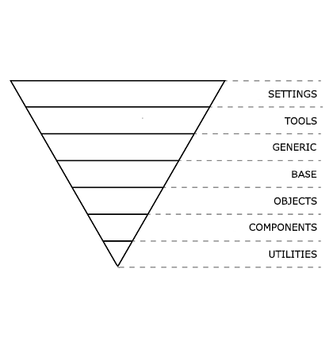
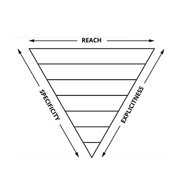

# Les 7 capes de CSS

Cada projecte necessita alguna organització. Escriure qualsevol nou estil al
final del fitxer converteix les coses en ingestionables i confuses per
qualsevol altra persona que treballi en el projecte.

La base d'aquesta guia és la categorització. Categoritzant les regles de CSS es
comencen a definir patrons i podem marcar unes bones pràctiques a seguir.

El CSS s'organitza en 7 capes en forma de triangle invertit:

Les capes són les següents:

- **1-Settings**: variables globals de configuració, definició de colors, etc.

- **2-Tools**: mixins i funcions globals. És important que no existeixi cap
  output de CSS en aquestes dues primeres capes \(_i.e._ un projecte amb només
  Settings i Tools hauria de generar un arxiu CSS buit\).

- **3-Generic**: reset/normalització d'estils, box-sizing, etc. És la primera
  capa que genera CSS compilat.

- **4-Base**: estils base, o sigui, els estils per elements HTML purs \(H1, A,
  TABLE, etc\). Aquests elements tenen estils per defecte del navegador, així
  que es poden redefinir aquí. Habitualment serà la primera capa que genera CSS
  que personalitzarem en un projecte.

- **5-Objects**: Selectors basats en classes que defineixen patrons de disseny
  sense estil, abstractes, com per exemple el [Media
  Object](http://www.stubbornella.org/content/2010/06/25/the-media-object-saves-hundreds-of-lines-of-code/)
  o el [Nav](https://csswizardry.com/2011/09/the-nav-abstraction/). Aquests
  objects estan basats en [OOCSS, Object Oriented
  CSS](https://www.smashingmagazine.com/2011/12/an-introduction-to-object-oriented-css-oocss/).
  Modificar alguna propietat CSS d'un Object és una acció delicada que
  probablement tingui conseqüències més enllà de la modificació d'una instància
  concreta.

- **6-Components**: components específics de la UI. Aquí és on es desenvolupa
  la gran majoria de la feina en cada projecte. Els components d'una interfície
  acostumen a estar compostos d'Objectes i Components. Modificar un component
  no té conseqüències fora del context que estiguem desenvolupant.

- **7-Utilities**: classes d'utilitat i helpers amb la capacitat de
  sobreescriure qualsevol regla definida prèviament en el triangle, e.g.
  classes per amagar contingut. Probablement utilitzin `!important` en les
  seves definicions.

La forma de triangle mostra com els estils generats s'ordenen: d'estils
genèrics a explícits, de poc específics a més específics, i des de globals a
atòmics.

Tot el CSS queda ordenat, doncs, segons aquestes tres mètriques:

1. **De genèric a explícit**. Comencem definint els atributs més genèrics, amb
   un abast més ampli, de baix nivell, i anem movent-nos cap a selectors més
   concrets i a mesura que anem baixant de nivell.

2. **De baixa a alta especificitat**. Els selectors amb menys especificitat
   apareixen més a prop de l'inici del CSS, i l'especificitat va augmentant
   progressivament a mida que avancem en el codi. D'aquesta manera evitem
   "guerres d'especificitat" tan com sigui possible. L'especificitat sempre
   creix cap avall.

3. **D'ampli espectre a localitzat**. Selectors del principi del CSS afecten
   àmpliament al DOM, i a cada capa els selectors afectaran a elements més
   concrets.

Font: [Manage large CSS projects with
ITCSS](http://www.creativebloq.com/web-design/manage-large-css-projects-itcss-101517528)

Font: [ITCSS: Scalable and Mantainable CSS
Architecture](https://www.xfive.co/blog/itcss-scalable-maintainable-css-architecture/)
